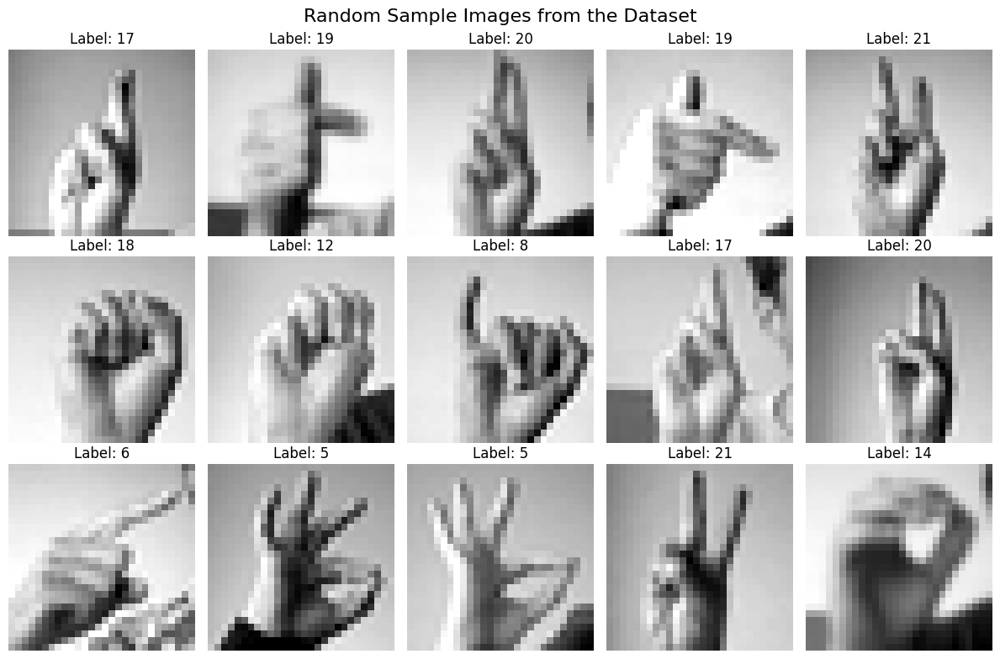
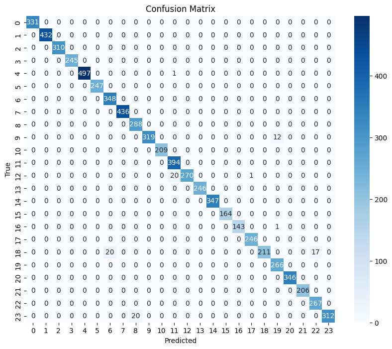
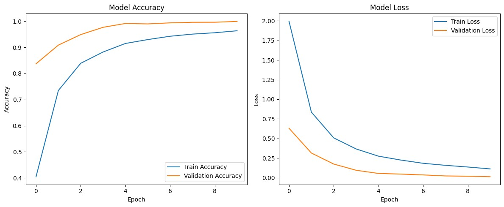

# Sign Language Recognition with a CNN

A convolutional neural network built in TensorFlow/Keras that classifies static American Sign Language (ASL) hand signs from grayscale images. It reaches **98.72% accuracy** on a held-out test set of 7,172 images.



## Results

| Metric | Validation | Test |
|---|---|---|
| Accuracy | 99.95% | **98.72%** |
| Loss | 0.0129 | 0.0478 |
| Macro F1 | – | 0.99 |



### Where the model struggles

Most classes score a perfect 1.00 F1. The errors are concentrated in a few pairs of hand shapes that look similar at 28×28 resolution:

| True letter | Recall | Most often confused with |
|---|---|---|
| T | 0.85 | G, X |
| N | 0.93 | M |
| Y | 0.94 | I |
| K | 0.96 | U |

N and M, for example, differ only in how many fingers fold over the thumb, which is hard to resolve in such small images.

## Dataset

[Sign Language MNIST](https://www.kaggle.com/datasets/datamunge/sign-language-mnist) (Kaggle):

- **27,455** training images and **7,172** test images
- 28×28 grayscale, stored as flattened pixel rows in CSV files
- **24 classes**, covering A–Y except J. J and Z are left out because they require motion.

The classes are roughly balanced, at about 950–1,300 training images each.

## Approach

**Preprocessing**
- Pixel values normalized to [0, 1] and reshaped to (28, 28, 1)
- Labels one-hot encoded
- Training data split 80/20 into train and validation sets (`random_state=42`)

**Data augmentation** (`ImageDataGenerator`)
- Rotation ±10°, zoom 10%, horizontal and vertical shifts of 10%

**Model architecture**

```
Conv2D(32, 3×3, ReLU) → MaxPool(2×2)
Conv2D(64, 3×3, ReLU) → MaxPool(2×2)
Flatten → Dense(128, ReLU) → Dense(softmax)
```

**Training**
- Adam optimizer with categorical cross-entropy loss
- Batch size 64, 10 epochs

Validation accuracy rose from 83.7% after the first epoch to 99.95% by the tenth, with validation loss falling steadily the whole time.



## Getting started

1. Download `sign_mnist_train.csv` and `sign_mnist_test.csv` from the Kaggle link above and place them in a `Sign Language MNIST/` folder.
2. Install the dependencies:
   ```bash
   pip install tensorflow numpy pandas scikit-learn matplotlib seaborn
   ```
3. Open the notebook, update the two CSV paths in the loading cell to point at your copy, and run all cells.

The trained model is saved as `sign_language_cnn.h5`.

## Possible improvements

- Add dropout or batch normalization to further reduce overfitting.
- Train at a higher input resolution to better separate similar hand shapes like M and N.
- Extend to J and Z using video and a temporal model, such as a CNN feeding an LSTM.
- Add a real-time webcam demo with OpenCV.
